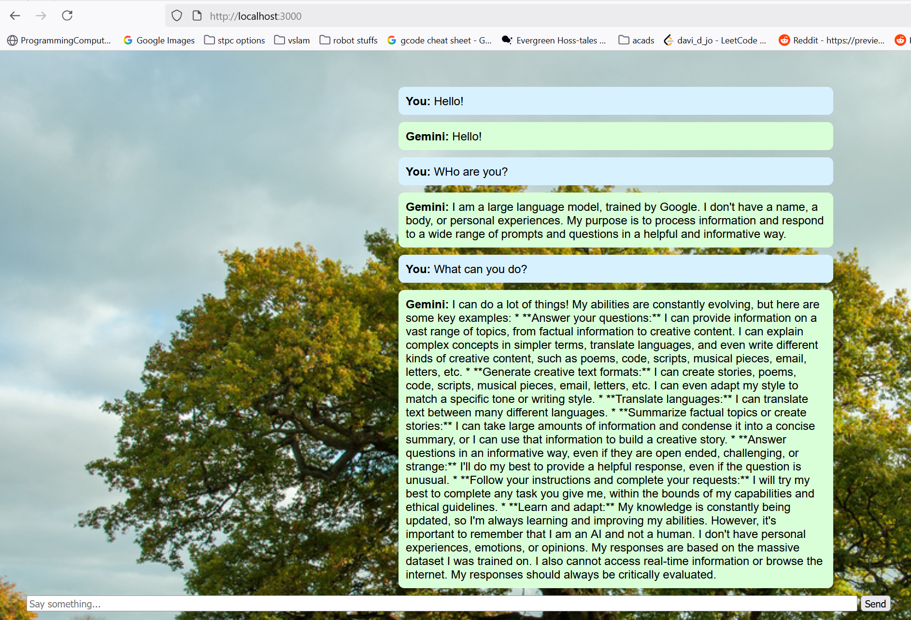

## Simple web interface for Gemini API, built with nodejs

<video controls src="Screen Recording 2025-07-09 155258.mp4" title="Title"></video>

https://github.com/Jsb925/23b2170_SoC25_Building_A_GPT_Bot/blob/main/Milestone%204-nodejs/Screen%20Recording%202025-07-09%20155258.mp4

Requires nodejs, express, axios, body-parser, dotenv as nodejs dependencies  
Add your own .env file to the "private folder" with a Gemini API key
